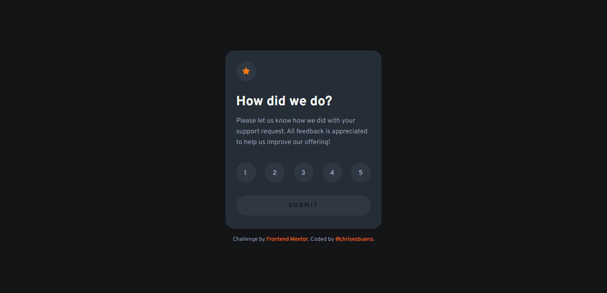

# Frontend Mentor - Interactive rating component solution

This is a solution to the [Interactive rating component challenge on Frontend Mentor](https://www.frontendmentor.io/challenges/interactive-rating-component-koxpeBUmI). Frontend Mentor challenges help you improve your coding skills by building realistic projects. 

## Table of contents

- [Overview](#overview)
  - [The challenge](#the-challenge)
  - [Screenshot](#screenshot)
  - [Links](#links)
- [My process](#my-process)
  - [Built with](#built-with)
  - [What I learned](#what-i-learned)
- [Author](#author)

## Overview

### The challenge

Users should be able to:

- View the optimal layout for the app depending on their device's screen size
- See hover states for all interactive elements on the page
- Select and submit a number rating
- See the "Thank you" card state after submitting a rating

### Screenshot



### Links

- Solution URL: [Solution](https://www.frontendmentor.io/challenges/interactive-rating-component-koxpeBUmI/hub/interactive-rating-component-NL8Od_fFEu)
- Live Site URL: [Demo](https://chrisesbueno.github.io/interactive-rating/)

### My process

### Built with

- Semantic HTML5 markup
- CSS custom properties
- Flexbox
- CSS Grid
- Mobile-first workflow
- JS features

### What I learned

```js
submit.addEventListener('click', () => {
    numbers.forEach(element => {
        let value = element.value
        if (element.checked) {
            document.getElementById('text').innerHTML = `You selected ${value} out of 5`;
            rating.style.display = 'none';
            selection.style.display = 'flex'
        } else {
            element.addEventListener('change', () => {
                submit.style.display = 'block';
                submit2.style.display = 'none';
            })
        }
    });
})

numbers.forEach(element => {
    element.addEventListener('change', () => {
        submit.style.display = 'block';
        submit2.style.display = 'none';
    })
});
```

## Author

- Frontend Mentor - [@chrisesbueno](https://www.frontendmentor.io/profile/chrisesbueno)
- Twitter - [@chrisesbueno](https://www.twitter.com/chrisesbueno)

